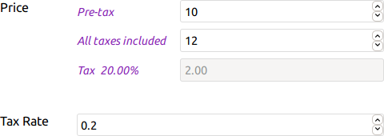

#  Edit Price Helper

> A small jQuery plugin to help edit prices with taxes.

The goal of this script is to give a real-time feedback of the taxes when you edit a price.

Say you have a no-tax price input and another one for the tax rate on a form: the script will add an all taxes included price input and the tax amount, keeping all values in sync. The added inputs are just here to help fill the original inputs, their values are not meant to be posted.

**[Check the documentation](https://tcharlss.github.io/editpricehelper/) to get started and see some examples.**